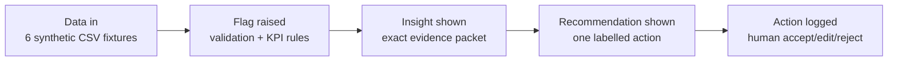

# MIS Copilot User Flow

```mermaid
flowchart LR
  A[Data in\n6 synthetic CSV fixtures] --> B[Flag raised\nvalidation + KPI rules]
  B --> C[Insight shown\nexact evidence packet]
  C --> D[Recommendation shown\none labelled action]
  D --> E[Action logged\nhuman accept/edit/reject]
```

The model is only called after the deterministic flag and evidence packet exist. The final state is a human decision, not an autonomous action.
